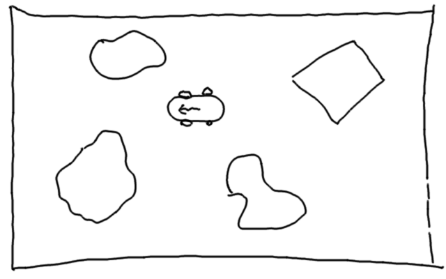

# Building self-driving cars

In this project, I want to use machine learning to train a model
to drive a car safely through a 2D world. I am a complete
beginner to machine learning, and I want to document everything
I do and learn in order to help other beginners start a similar
project.

## The Goal

The sketch above shows what I want to build. There is an arena,
obstacles within it and a car. Fow now, my goal is the following:

* the car should randomly drive through the arena
* it should never hit any obstacles

Pretty low goal, but hey.

## Disclaimer
I didn't have the idea for this project. A couple of months ago I was
browsing the interwebs and stumbled upon a website that featured
self-driving cars in an arena, as described above. Sadly, I
really can't find that website anymore, otherwise I would post
a link here.

However, I will develop all ideas on how to actually implement
this project on my own here. I don't intend to find that website
and copy the implementation or any ideas. That being said,
let's get started!

## My first try

My first try will be the following:

* build an application in JS where I can drive a car through
an arena filled with obstacles
* the car will be equipped with "distance sensors"
that can measure the distance to the nearest obstacle
in a couple of directions
* I will drive the car through the arena by hand a couple of
times and record the sensor data (input to the machine learning)
and the direction of the virtual steering wheel (output of the
machine learning mechanism)
* I will use that data to train a simple neural network, probably
using TensorFlow, to mimic my steering
* I will export the trained model and make it available in the JS
* let the car drive on its own ;)

I am aware that this approach is probably a bit naive, but that
is the whole point of this project. I want to learn by making
mistakes, so here we go.

