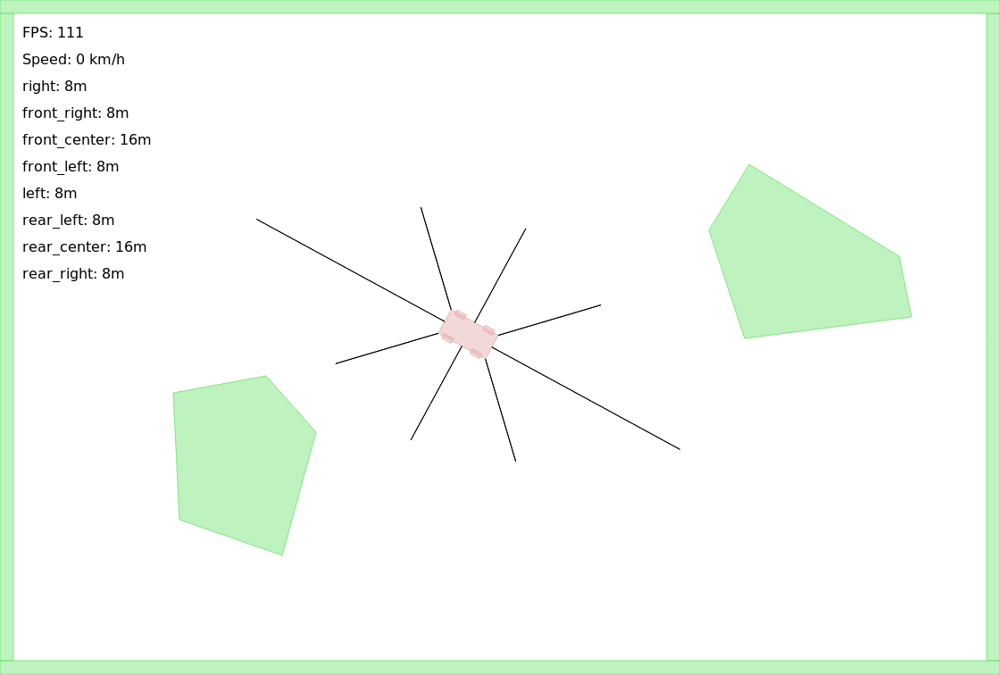

# Building self-driving cars

In this project, I want to use neural networks to drive a car
safely through a 2D world. I am a complete
beginner to neural networks and want to document everything
I do and learn in order to help other beginners start a similar
project.

## The Goal

The sketch above shows what I want to build. There is an arena,
obstacles within it and a car. Fow now, my goal is the following:

* the car should randomly drive through the arena
* it should never hit any obstacles

## Disclaimer
I didn't have the idea for this project. A couple of months ago I was
browsing the interwebs and stumbled upon a website that featured
self-driving cars in an arena, as described above. Sadly, I
really can't find that website anymore, otherwise I would post
a link here.

However, I will develop all ideas on how to actually implement
this project on my own here. I don't intend to find that website
and copy the implementation or any ideas. That being said,
let's get started!

## My first try

My first try will be the following:

* build an application in JS where I can drive a car through
an arena filled with obstacles
* the car will be equipped with "distance sensors"
that can measure the distance to the nearest obstacle
in a couple of directions
* I will drive the car through the arena by hand a couple of
times and record the sensor data (input to the machine learning)
and the direction of the virtual steering wheel (output of the
machine learning mechanism)
* I will use that data to train a simple neural network, probably
using TensorFlow, to mimic my steering
* I will export the trained model and make it available in the JS
* let the car drive on its own ;)

I am aware that this approach is probably a bit naive, but that
is the whole point of this project. I want to learn by making
mistakes, so here we go.

## The arena
I have now finished implementing the physics simulation part
of this project. It is based [on this example.](https://github.com/domasx2/gamejs-box2d-car-example)
It uses the Javascript port of the physics library Box2D 
to simulate the car physics properly.

The simulated car is 4m long and 2m wide. The car is equipped 
with 8 distance sensors, equally distributed around the car.
The front and back sensors have a maximum range of 16m, whereas
the other sensors only measure up to 8m. The sensors are displayed
as black lines going out of the car. Whenever something comes
wihthin the range of a sensor, the distance to the object is
measured and stored. The sensor data is displayed in the top left
of the display.

It is possible to add obstacles to the arena by drawing polygons
with the mouse. Just click anywhere, and an edge will be added.
Then close the polygon by clicking close to where the polygon started.

Here is a screenshot of it all:

The car can be steered using the arrrow keys on the keyboard.

## Preparing for machine learning
My thinking is the following: if I just record enough data of the car
being driven by me, I can use a classifier neural network
to decide what key should be pressed in any given situation.

So that is what I built. I added the possibility to record telemetry.
The following will be recorded as soon as you press the Space key:
* readings of all sensors (0 - 16 meters)
* angle of the wheels (-20 - 20 degrees)
* speed of the car (0 - 12 m/s) 
* keys pressed by the player

I want to build the neural network using Keras. Keras is a Python
library for easy creation of neural networks. Especially, there
is a library to run trained Keras models in the browser using
Javascript. The workflow would then be the following:
* drive the car to collect telemetry data
* train a neural network on this classification task
with Keras
* export the trained Keras model
* load it in the browser and use it to decide what keys
to press

## Failing with classification
Turns out, classification does not work for me. I built a simple
neural network in Keras, following a tutorial on the MNIST dataset
and tried to adapt it to my needs. I also imported the trained
model to my Javascript, but the steering was not good at all.
Here is what I think the main problems were:

* Normal classification is just the wrong tool for the job. I
noticed that even after playing with many parameters, the car
would often not even move at all. That's because the decisions
that the network made oscillated so quickly between going
backwards, forwards, left and right that the car did not move
at all.
* Not enough training data. I recorded about 1 hour of driving.
Thats about 50000 examples of classification. Maybe, this is
not enough, although it is enough for decent decision making
on the MNIST dataset, so my focus is on point 1.

It seems like I need a neural network with memory.

## Reinforcement Learning
I happened to stumble upon this lecture on 
MIT OpenCourseware: <http://selfdrivingcars.mit.edu/>
I watched the whole lecture and learned quite a lot.
So now I think that what is best suited for my task
is called Reinforcement Q-Function Learning. On a high level of abstraction,
it looks simple enough: the Q function is a function that
takes the current state and an action and returns an estimate
of the reward, measured as a real number. A neural network can
learn this Q function through reinforcement learning. That's a
kind of unsupervised learning. In this example, I think it would
work like this:
* the network starts with a random Q function
* whenever the network is asked to decide what key to press,
the current state is captured and the Q function is evaluated
for every possible action (=key press)
* the action that returned the highest Q value is picked and executed
* Every now and then (for example, after every fifth decision),
the network is told how it performed through a reward. If the
network did well, the reward is positive and large. If it did
not do well, the reward can be negative. This is used to adapt
the network and better approximate the Q function.

I found the [ConvNetJS](http://cs.stanford.edu/people/karpathy/convnetjs/)
library to do Q function Reinforcement learning in the browser.
Besides setting a couple of parameters, I just need to provide
a good reward function and the network will train itself.

## Finding a good reward function
Currently, I am trying to find a good reward function. These
are the parameters I am considering as input to the reward function:

* average speed since the last reward (high)
* distance traveled (high)
* number of crashes (touching a wall) (low)
* time going forwards (high)
* time going backwards (low)

I have noted in braces next to each of the points whether I want
that value to be high or low.

With some of the functions I have tried, the behaviour of the
car looks very promising, but it does not quite yet qualify
as good driving. I am now in the process of figuring out on how
to improve the driving.